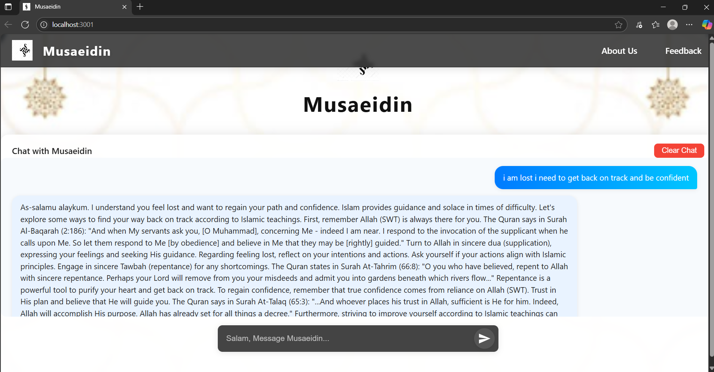

# Musaeidin (مُسَاعِدِين)

Musaeidin is an Islamic AI chatbot designed to provide Muslims with authentic, compassionate, and practical guidance based on the Quran, Sahih Hadith, and trusted Islamic scholars. The chatbot offers a beautiful, modern chat interface and is built to be both spiritually supportive and user-friendly.

## 🌟 Features

- AI answers based on Quran, Hadith, and scholarly opinion
- Empathetic, brotherly tone for mental and spiritual support
- Modern, responsive chat UI with clear chat option
- Feedback and About Us sections

## 🛠️ Technologies Used

- **Frontend:** React, React Markdown, CSS (modern, responsive design)
- **Backend:** Flask, Python, flask-cors, requests, python-dotenv
- **AI:** Google Gemini API (can be adapted for OpenAI GPT)

## 🚀 How to Run Locally

### 1. Clone the Repository

```bash
git clone https://github.com/yourusername/musaeidin.git
cd musaeidin
```

### 2. Set Up the Backend

```bash
cd backend
python -m venv venv
source venv/bin/activate  # On Windows: venv\Scripts\activate
pip install -r requirements.txt
```

- Create a `.env` file in the `backend/` folder:
  ```
  GEMINI_API_KEY=your_actual_gemini_api_key_here
  ```
- Start the backend:
  ```bash
  python app.py
  ```

### 3. Set Up the Frontend (in a new terminal)

```bash
cd frontend
npm install
npm start
```

- The frontend will run at `http://localhost:3000` and the backend at `http://localhost:5000`.

## 🌍 How to Deploy

### Frontend (Vercel)

1. Push your code to GitHub.
2. Go to [vercel.com](https://vercel.com), import your repo, and set the root directory to `frontend`.
3. Set build command: `npm run build` and output directory: `build`.
4. Deploy and get your live URL.

### Backend (Railway)

1. Push your code to GitHub.
2. Go to [railway.app](https://railway.app), create a new project, and set the root directory to `backend`.
3. Set the start command: `python app.py`.
4. Add your `GEMINI_API_KEY` in the Variables tab.
5. Deploy and get your public backend URL.

### Connect Frontend to Backend

- In `frontend/src/App.js`, update fetch URLs to use your Railway backend URL for `/chat` and `/feedback`.
- Redeploy your frontend.

## 📷 Screenshots



## 🤝 Contributing

Pull requests are welcome! For major changes, please open an issue first to discuss what you would like to change.

## 📜 License

[MIT](LICENSE)
